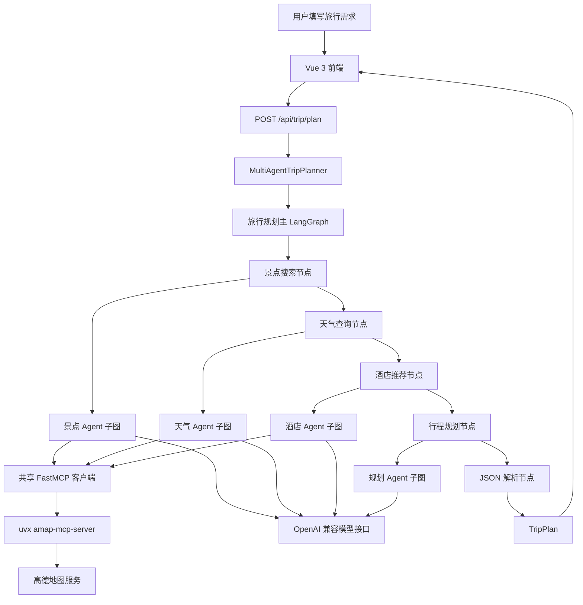

# LangGraph 多智能体旅行规划助手 🌍✈️

基于 LangGraph 构建的多智能体旅行规划应用。系统根据目的地、日期、交通方式、住宿偏好和旅行偏好，依次完成景点搜索、天气查询、酒店推荐与多日行程生成，并通过 Vue 3 页面展示地图、景点图片、每日安排和预算信息。

当前版本：`v0.3.0`

## 功能概览

- 通过4个职责独立的 Agent 协作生成旅行计划
- 使用 LangGraph `StateGraph` 显式管理节点、状态和执行顺序
- 通过 FastMCP 调用高德地图 MCP 服务，查询景点、天气和酒店信息
- 使用 OpenAI 兼容接口接入大语言模型
- 使用 FastAPI 提供类型安全的 HTTP API
- 使用 Vue 3、TypeScript 和 Ant Design Vue 构建前端
- 支持高德地图展示、POI 图片、预算信息和结果导出
- Agent 或结果解析失败时保留原有备用计划机制

## 四个 Agent

1. **景点搜索 Agent**：根据目的地与用户偏好，通过高德地图 MCP 搜索相关景点。
2. **天气查询 Agent**：查询目的地天气，为行程安排和出行建议提供信息。
3. **酒店推荐 Agent**：结合目的地与住宿偏好搜索酒店。
4. **行程规划 Agent**：汇总景点、天气、酒店和用户需求，生成结构化多日旅行计划。

前三个 Agent 共享同一个高德 MCP 客户端；行程规划 Agent 只调用模型，不调用地图工具。

## 系统架构



旅行主流程是固定串行图：

```text
START → 景点搜索 → 天气查询 → 酒店推荐 → 行程规划 → JSON 解析 → END
```

每个 Agent 也是一个已编译的 LangGraph 子图。带工具的 Agent 会执行“模型判断 → MCP 工具调用 → 工具结果回填 → 模型回答”的循环，工具调用最多执行三轮。

> 当前项目没有并行节点、自动重试、Checkpointer、长期记忆、人工确认或流式进度，请勿将这些能力视为已经实现。

## 技术栈

### 后端

- Python 3.13（项目验证环境）
- LangGraph 1.1.x
- OpenAI Python SDK（兼容 OpenAI 协议的模型服务）
- FastMCP 2.x
- FastAPI
- Pydantic V2
- Uvicorn

### 前端

- Vue 3
- TypeScript
- Vite
- Ant Design Vue
- Axios
- 高德地图 JavaScript API
- html2canvas、jsPDF

## 项目结构

```text
Agent_study/
├── backend/
│   ├── app/
│   │   ├── agents/
│   │   │   ├── langgraph_agent.py       # Agent 状态、节点和工具循环子图
│   │   │   ├── trip_planner_agent.py    # 提示词、依赖初始化、解析和备用计划
│   │   │   └── trip_planner_graph.py    # 旅行规划主 StateGraph
│   │   ├── api/
│   │   │   ├── main.py                  # FastAPI 应用入口
│   │   │   └── routes/                  # 旅行、POI 和地图接口
│   │   ├── models/
│   │   │   └── schemas.py               # Pydantic 请求、响应和业务模型
│   │   ├── services/
│   │   │   ├── llm_service.py           # OpenAI 兼容模型客户端
│   │   │   ├── mcp_client.py            # FastMCP stdio 客户端
│   │   │   ├── amap_service.py          # 高德地图服务封装
│   │   │   └── amap_photo_service.py    # 高德 POI 图片查询
│   │   └── config.py
│   ├── tests/                            # 离线行为、Graph、MCP 和 API 契约测试
│   ├── requirements.txt
│   └── .env.example
├── frontend/
│   ├── src/
│   │   ├── services/api.ts
│   │   ├── types/index.ts
│   │   └── views/
│   │       ├── Home.vue
│   │       └── Result.vue
│   ├── package.json
│   └── .env.example
└── README.md
```

## 环境要求

- Windows 10/11
- Python 3.13
- Node.js 18 或更高版本
- 可用的 OpenAI 兼容模型 API
- 高德地图 Web 服务 Key
- 高德地图 Web 端 JavaScript API Key 与安全密钥
- `uvx`，用于启动 `amap-mcp-server`

## 快速开始

以下命令使用 PowerShell。

```powershell
git clone https://github.com/sanhuaz/Agent_study.git
Set-Location ".\Agent_study"
```

### 1. 启动后端

```powershell
Set-Location ".\backend"

python -m venv .venv
& ".\.venv\Scripts\Activate.ps1"
python -m pip install -r requirements.txt

Copy-Item ".\.env.example" ".\.env"
# 编辑 .env，填入自己的模型和高德地图配置

python -m uvicorn app.api.main:app `
  --host 0.0.0.0 `
  --port 8000 `
  --log-level info
```

后端地址：

- API 根地址：`http://127.0.0.1:8000`
- Swagger 文档：`http://127.0.0.1:8000/docs`
- 健康检查：`http://127.0.0.1:8000/health`

### 2. 启动前端

```powershell
Set-Location "..\frontend"

npm install
Copy-Item ".\.env.example" ".\.env.local"
# 编辑 .env.local，填入自己的前端配置

npm run dev -- --host 0.0.0.0 --port 5173
```

访问：`http://127.0.0.1:5173`

## 环境变量

### 后端 `backend/.env`

| 变量 | 说明 |
|---|---|
| `LLM_MODEL_ID` | OpenAI 兼容模型名称 |
| `LLM_API_KEY` | 模型服务 API Key |
| `LLM_BASE_URL` | 模型服务 Base URL |
| `LLM_TIMEOUT` | 模型请求超时秒数 |
| `AMAP_API_KEY` | 高德地图 Web 服务 Key，同时传递给 MCP 服务 |
| `HOST` / `PORT` | 后端监听地址与端口 |
| `CORS_ORIGINS` | 允许访问后端的前端地址 |
| `LOG_LEVEL` | 日志级别 |

### 前端 `frontend/.env.local`

| 变量 | 说明 |
|---|---|
| `VITE_API_BASE_URL` | 后端 API 地址 |
| `VITE_AMAP_WEB_KEY` | 高德地图 Web 端 JavaScript API Key |
| `VITE_AMAP_WEB_JS_KEY` | 高德地图安全密钥 |

真实 `.env` 和 `.env.local` 已由 `.gitignore` 忽略。不要把 Key 写入源码、README、日志或提交历史。

## 使用流程

1. 在首页填写目的地、日期、交通方式、住宿偏好和旅行偏好。
2. 前端向 `POST /api/trip/plan` 提交 `TripRequest`。
3. LangGraph 按固定顺序调用景点、天气、酒店和规划 Agent。
4. 规划 Agent 返回 JSON，解析节点将其校验为 `TripPlan`。
5. 前端展示每日行程、天气、酒店、餐饮、预算、地图和景点图片。
6. Agent 执行或 JSON 解析失败时，后端返回原有备用计划。

## 主要 API

| 方法 | 路径 | 说明 |
|---|---|---|
| `POST` | `/api/trip/plan` | 生成旅行计划 |
| `GET` | `/api/poi/photo` | 根据景点名称查询高德 POI 图片 |
| `GET` | `/api/poi/search` | 搜索 POI |
| `GET` | `/api/poi/detail/{poi_id}` | 查询 POI 详情 |
| `GET` | `/api/map/poi` | 地图 POI 搜索接口 |
| `GET` | `/api/map/weather` | 天气查询接口 |
| `POST` | `/api/map/route` | 路线规划接口 |

## 测试与验证

后端离线测试不会调用真实 LLM 或高德地图服务：

```powershell
Set-Location ".\backend"
python -m pip install pytest
python -m pytest -q
```

`v0.3.0` 发布时记录：

- Pytest：`19 passed, 11 subtests passed`
- 项目虚拟环境在卸载 `hello-agents` 后仍可正常导入并运行离线测试
- `pip check` 未发现依赖冲突
- Vite 直接生产构建完成，共转换 3482 个模块
- 没有执行真实 LLM 与高德地图端到端调用

## 已知边界

- 4个 Agent 当前固定串行执行，完整响应时间受模型和高德服务网络状况影响。
- Graph 没有节点级重试、并行查询、持久化、流式进度或中断恢复。
- `plan_trip()` 发生异常时会返回备用计划，现有 API 仍可能把备用计划标记为成功。
- `AmapService` 的部分结构化地图接口仍保留占位解析逻辑；旅行主流程直接消费 MCP 文本结果。
- 前端完整 `npm run build` 仍受既有 TypeScript 类型问题影响；Vite 直接生产构建已验证通过。

## 版本历史

- `v0.1.0`：使用 LangGraph 显式编排旅行规划主流程。
- `v0.2.0`：修复 MCP 工具发现，迁移高德 POI 图片源并清理敏感配置。
- `v0.3.0`：将4个 Agent 改造为 LangGraph 子图，使用 OpenAI SDK 与 FastMCP 完全移除 HelloAgents 运行时依赖。

## 致谢

- [LangGraph](https://github.com/langchain-ai/langgraph)
- [FastMCP](https://github.com/jlowin/fastmcp)
- [高德地图开放平台](https://lbs.amap.com/)
- [amap-mcp-server](https://github.com/sugarforever/amap-mcp-server)

---

**LangGraph 多智能体旅行规划助手** — 让旅行计划生成过程更清晰、可测试、可维护。
