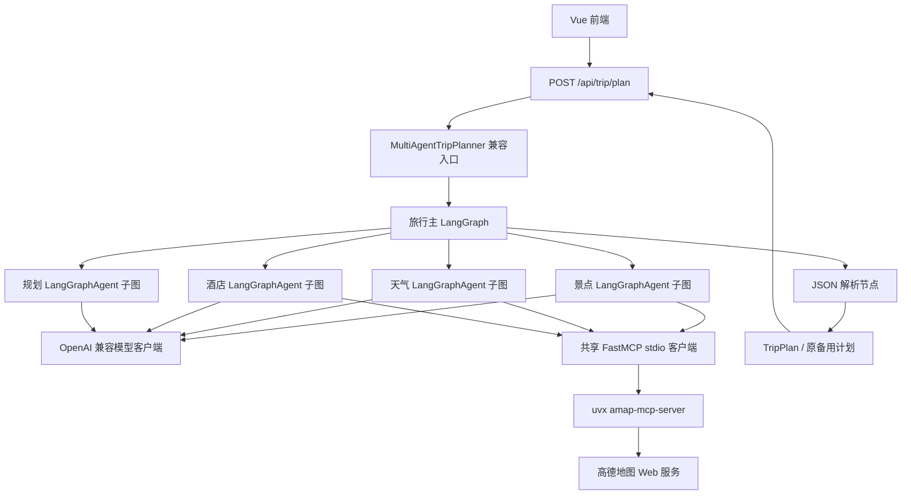
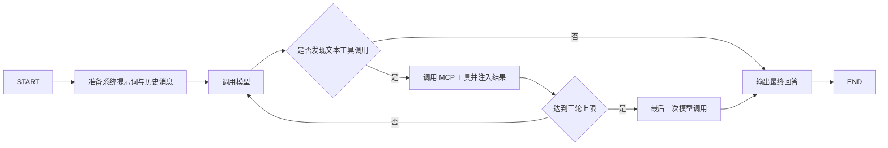

# 智能旅行助手纯 LangGraph 框架重构说明

## 1. 文档信息

- 项目目录：`E:\Codex\Agent_study`
- 重构日期：2026-08-11
- 重构基线：`v0.2.0` / `ab5b4ea`
- 文档性质：本次纯 LangGraph 框架重构的范围、实现与验收记录
- 核心原则：只替换框架层，不改变已经完成的功能、公共接口、数据结构和前端表现

本文档已覆盖原有“仅重构编排层”的要求文档。原文要求保留 HelloAgents 的 `SimpleAgent`、`HelloAgentsLLM` 和 `MCPTool`，已经不再符合本次“完全舍弃 HelloAgents 框架”的目标。

## 2. 重构结论

后端运行时代码已经不再使用 HelloAgents：

- 旅行主流程继续由 LangGraph `StateGraph` 编排。
- 原四个 `SimpleAgent` 已替换为四个独立的 `LangGraphAgent` 子图。
- 原 `HelloAgentsLLM` 已替换为项目内部的 OpenAI 兼容模型客户端。
- 原 `MCPTool` 已替换为直接基于 FastMCP 的 stdio 客户端。
- `hello-agents` 已从生产依赖中删除，并从项目本地虚拟环境卸载。
- 后端 `app` 目录和 `requirements.txt` 中不存在 HelloAgents 导入或依赖声明。

前端源码没有修改。前端原有的“HelloAgents 智能旅行助手”标题和页脚文字仍然存在，这是保留既有页面表现的结果，只是旧产品文案，不代表后端仍依赖 HelloAgents 框架。

## 3. 重构范围

### 3.1 本次完成

1. 用 LangGraph 子图替换四个 `SimpleAgent`。
2. 保留原有文本工具调用协议 `[TOOL_CALL:工具名:参数]`。
3. 保留每个工具 Agent 最多三轮工具调用，第三轮后再调用一次模型生成最终回答的行为。
4. 保留 Agent 历史消息的写入与后续调用携带方式。
5. 使用 OpenAI Python SDK 直接调用现有 OpenAI 兼容 LLM 地址。
6. 使用 FastMCP 直接发现和调用 `uvx amap-mcp-server` 提供的工具。
7. 保留前三个 Agent 共享同一个高德 MCP 客户端，规划 Agent 不使用工具。
8. 保留旅行主 Graph 的固定串行顺序和全部中间状态。
9. 删除 HelloAgents 依赖、导入、测试替身和旧框架环境文件回退逻辑。
10. 增加 LangGraph Agent 子图的离线测试。

### 3.2 明确不做

以下内容不是框架迁移所必需，因此本次没有修改：

- 不修改 Vue 前端源码、样式、交互、接口调用、超时、地图和导出。
- 不优化提示词，不改变查询文本。
- 不改变 LLM 调用次数和旅行主流程顺序。
- 不加入并行、重试、流式输出、Checkpointer、持久化、记忆、人工确认或反思循环。
- 不修复备用计划仍被 API 标记为成功的问题。
- 不修复 `/api/trip/health` 访问不存在属性的问题。
- 不完成 `AmapService` 中已有的 TODO 和占位返回。
- 不修复前端 TypeScript 既有错误、图片地址硬编码或 README 旧说明。
- 不执行真实 LLM 或高德规划调用，不消耗外部服务额度。

## 4. 重构后架构



### 4.1 旅行主 Graph


主 Graph 仍然只编译一次。每个请求通过新的 `TripPlannerState` 执行，不改变以下顺序：

> 景点搜索 → 天气查询 → 酒店推荐 → 行程规划 → JSON 解析

### 4.2 Agent 子图



四个 Agent 各自持有一个已编译子图。景点、天气和酒店 Agent 使用共享 MCP 客户端；规划 Agent 直接调用模型，不进入工具节点。

## 5. 文件职责

| 文件 | 重构后职责 |
|---|---|
| `backend/app/agents/langgraph_agent.py` | 定义 Agent 状态、模型节点、工具节点、条件边、三轮上限、历史消息和文本工具参数解析。 |
| `backend/app/agents/trip_planner_graph.py` | 定义旅行主状态、五个业务节点和固定串行边。 |
| `backend/app/agents/trip_planner_agent.py` | 保留原公共入口、提示词、查询构建、JSON 解析和备用计划；初始化四个 LangGraph 子图。 |
| `backend/app/services/llm_service.py` | 读取现有 LLM 配置并通过 OpenAI SDK 调用兼容接口。 |
| `backend/app/services/mcp_client.py` | 通过 FastMCP stdio 发现工具、转换工具名并同步调用 MCP。 |
| `backend/app/services/amap_service.py` | 继续提供既有地图服务接口，内部 MCP 实现改为新的 FastMCP 客户端。 |
| `backend/requirements.txt` | 删除 `hello-agents`，显式保留 LangGraph、OpenAI 和 FastMCP 依赖。 |
| `backend/tests/test_langgraph_agent.py` | 验证 Agent 子图工具循环、迭代上限、参数类型转换和历史行为。 |
| `backend/tests/test_mcp_client.py` | 离线验证 MCP 工具发现、名称前缀转换和既有 action 调用接口。 |
| `backend/tests/test_trip_planner_*.py` | 继续验证原旅行规划行为、主 Graph 和 API 契约。 |

## 6. 保持不变的外部行为

### 6.1 API 与模型

- `POST /api/trip/plan` 路径和 HTTP 方法不变。
- `TripRequest` 字段、顺序和校验不变。
- `TripPlanResponse` 的 `success`、`message`、`data` 结构不变。
- 未预期路由异常仍返回 HTTP 500。
- Graph 或 Agent 执行失败时仍由 `plan_trip()` 返回原备用计划。

### 6.2 规划行为

- 原四个系统提示词未修改。
- 景点、天气、酒店和规划查询文本未修改。
- 仍只取第一个偏好作为景点关键词。
- 仍依次调用四个 Agent，不并行。
- 仍支持 JSON 代码块、普通代码块和内嵌 JSON 对象三种提取方式。
- JSON 不存在、格式错误或模型校验失败时仍返回原备用计划。
- 备用计划中的日期、景点、经纬度占位、三餐和建议保持原样。

### 6.3 配置

继续使用现有配置项：

- `LLM_MODEL_ID`
- `LLM_API_KEY`
- `LLM_BASE_URL`
- `LLM_TIMEOUT`
- `AMAP_API_KEY`

项目只加载自己的 `.env`。不再尝试读取外部 HelloAgents 目录中的 `.env`。

## 7. 依赖变化

删除：

```text
hello-agents[protocols]
```

直接使用：

```text
langgraph>=1.1.2,<1.2.0
openai>=1.109.1,<2.0.0
fastmcp>=2.0.0
uv>=0.8.0
```

项目本地 `backend\.venv` 中的 `hello-agents 0.2.9` 已卸载。卸载后 `hello_agents` 模块不可发现，后端仍可正常导入，`pip check` 未发现依赖冲突。

## 8. 验证结果

| 验证项 | 结果 | 说明 |
|---|---|---|
| 重构前后端基线 | 通过 | 重构前为 `14 passed, 21 warnings, 11 subtests passed`。 |
| 重构后 Pytest | 通过 | `19 passed, 21 warnings, 11 subtests passed`。 |
| 无 HelloAgents 环境测试 | 通过 | 项目 `.venv` 卸载旧框架后，16 个 `unittest` 测试全部通过。 |
| 依赖一致性 | 通过 | 项目 `.venv` 执行 `pip check` 返回无冲突。 |
| 后端导入 | 通过 | 在 `hello_agents` 不存在时成功导入 FastAPI 应用、LangGraph Agent 和 MCP 客户端。 |
| HelloAgents 运行时扫描 | 通过 | `backend/app` 无 HelloAgents 导入；仅配置中的旧产品名字符串保留。 |
| 前端源码 | 通过 | Git diff 显示 `frontend` 无修改。 |
| Vite 生产构建 | 通过 | 3482 个模块完成构建；仍有原有大包警告。 |
| 真实 LLM / 高德全流程 | 未执行 | 避免产生外部调用、额度消耗和网络副作用。 |

现有 Pydantic、FastAPI 和前端类型问题相关警告没有在本次框架重构中处理。

## 9. 验收边界

“完全舍弃 HelloAgents 框架”在本项目中的验收标准是：

1. 生产依赖不声明 `hello-agents`。
2. 后端运行时代码不导入 `hello_agents`。
3. Agent 执行循环由 LangGraph 状态、节点和条件边实现。
4. LLM 与 MCP 不通过 HelloAgents 封装调用。
5. 在卸载 `hello-agents` 的项目环境中，后端可导入且离线测试通过。

以上五项均已满足。

项目中仍可能看到 HelloAgents 字样，来源仅包括未修改的前端品牌文案、旧 README、交接文档和历史说明。这些内容不属于运行时框架依赖；本次按照“前端不变、只做框架重构”的边界没有顺手改写。

## 10. 未验证风险

离线测试可以证明调用顺序、状态流转、文本工具协议、解析、回退和 API 契约保持一致，但不能证明真实模型服务与高德 MCP 在当前网络和密钥下必然成功。

首次真实联调时应重点观察：

- OpenAI 兼容服务是否完整支持当前聊天补全参数。
- 模型是否继续按 `[TOOL_CALL:...]` 文本格式返回工具调用。
- `uvx amap-mcp-server` 是否能发现非空工具列表。
- FastMCP 返回内容是否符合模型已有提示词预期。
- 完整串行调用是否仍能在前端五分钟超时内完成。

这些属于外部集成验证，不应与已经通过的离线行为等价测试混为一谈。

## 11. Git 说明

本次仅修改工作区，未自动执行 commit、push、创建分支或打标签。原 `v0.1.0`、`v0.2.0` 标签未改动。
