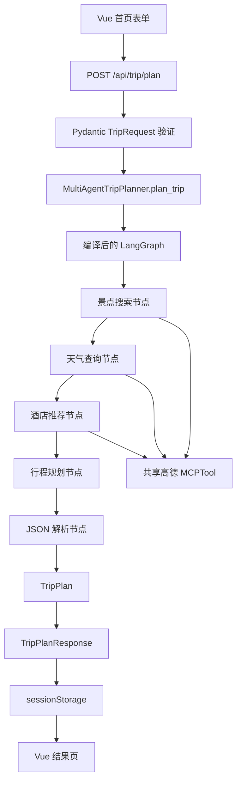

# 第十三章智能旅行助手 LangGraph 重构要求

## 1. 文档信息

- 文档性质：重构需求与验收基准
- 目标项目：`E:\hello-agents-main\code\chapter13\helloagents-trip-planner`
- 重构范围：后端旅行规划编排层
- 基线日期：2026-08-10
- 核心原则：只改变内部编排方式，不改变现有功能、接口、数据结构和用户可见表现

## 2. 重构背景

当前旅行规划流程由 `MultiAgentTripPlanner.plan_trip()` 使用普通 Python 代码依次调用四个 `SimpleAgent`：

1. 景点搜索 Agent。
2. 天气查询 Agent。
3. 酒店推荐 Agent。
4. 行程规划 Agent。
5. 解析规划 Agent 返回的 JSON，得到 `TripPlan`。
6. 执行失败或解析失败时生成备用计划。

该流程本质上是一个路径固定、步骤清晰、包含中间状态的工作流。此次重构使用 LangGraph 显式表达状态、节点和边，为后续测试、观测和扩展提供清晰边界。

本次重构不是功能升级，不得借此加入并行、流式输出、自动重试、持久化、反思循环或新的 Agent。

## 3. 重构目标

### 3.1 必须达到的目标

- 使用 LangGraph `StateGraph` 替换 `plan_trip()` 中手写的串行调度代码。
- 用明确的图状态保存用户请求和四个步骤的中间结果。
- 将景点搜索、天气查询、酒店推荐、行程规划和结果解析拆分为独立节点。
- 保持现有四个 `SimpleAgent`、提示词、LLM、MCPTool 和查询构建逻辑不变。
- 保持现有 FastAPI 接口、Pydantic 模型和前端调用方式不变。
- 保持现有成功、失败和备用计划行为不变。
- 为每个节点和完整工作流增加可重复、不会调用真实 API 的测试。
- 保证编译后的 Graph 只创建一次，每次请求使用独立状态。

### 3.2 本次不追求的目标

- 不优化现有提示词。
- 不提升生成结果质量。
- 不降低 LLM 调用次数。
- 不改变高德地图或 Unsplash 的接入方式。
- 不将 HelloAgents `SimpleAgent` 替换成 LangChain Agent。
- 不修复项目当前已有的业务缺陷。
- 不修改页面样式、交互、加载进度、地图或导出效果。

## 4. 现有行为基线

以下内容属于当前真实行为，重构后必须保持一致，即使部分行为并不理想。

### 4.1 前端请求行为

- 首页收集城市、开始日期、结束日期、交通方式、住宿偏好、旅行偏好和额外要求。
- 前端根据开始日期和结束日期计算旅行天数。
- 使用 Axios 向 `POST /api/trip/plan` 发送 JSON 请求。
- 请求超时仍为 120 秒。
- 加载进度仍然由前端定时器模拟，不改为后端实时进度。
- 成功结果仍写入 `sessionStorage`，然后跳转到 `/result`。

### 4.2 后端接口行为

- API 地址保持为 `POST /api/trip/plan`。
- 请求类型保持为 `TripRequest`。
- 返回类型保持为 `TripPlanResponse`。
- `MultiAgentTripPlanner.plan_trip(request)` 的输入和返回类型保持不变。
- `get_trip_planner_agent()` 继续使用单例模式。
- FastAPI 路由继续以当前方式调用同步的 `plan_trip()`。
- 不在本次重构中改成异步 Graph 或后台任务。

### 4.3 Agent 初始化行为

- 四个 Agent 继续使用同一个 `HelloAgentsLLM` 实例。
- 景点、天气和酒店 Agent 继续共享同一个高德 `MCPTool` 实例。
- MCPTool 继续通过 `uvx amap-mcp-server` 启动。
- `auto_expand=True` 保持不变。
- Planner Agent 继续不挂载 MCP 工具。
- Graph 节点不得重新创建 LLM、MCPTool 或子 Agent。

### 4.4 Agent 执行行为

- 四个 Agent 必须保持串行执行。
- 固定顺序必须是：景点 → 天气 → 酒店 → 规划 → 解析。
- 景点关键词仍然只选择 `preferences` 中的第一个值。
- 没有偏好时仍然使用“景点”作为关键词。
- 天气查询文本保持现有格式。
- 酒店查询文本保持现有格式。
- Planner 查询继续包含用户需求、景点结果、天气结果和酒店结果。
- 额外要求仍追加在 Planner 查询末尾。
- 每次请求仍然只调用四次 `SimpleAgent.run()`。

### 4.5 结果解析和错误行为

- 继续支持从以下三种形式提取 JSON：
  - `json` Markdown 代码块。
  - 普通 Markdown 代码块。
  - 文本中的第一个 `{` 到最后一个 `}`。
- 继续使用 `json.loads()` 解析。
- 继续使用 `TripPlan(**data)` 做最终结构验证。
- JSON 提取、JSON 解析或 Pydantic 验证失败时，继续调用现有备用计划方法。
- Agent 执行阶段发生异常时，继续返回现有备用计划。
- 本次不新增重试，不将现有备用计划改成 HTTP 500。
- 备用计划中的通用景点名、占位坐标、空天气和无预算行为保持不变。

### 4.6 结果页行为

- 继续从 `sessionStorage` 读取 `TripPlan`。
- 继续显示概览、预算、地图、每日行程、酒店、餐饮和天气。
- 景点图片仍由结果页逐个调用 `/api/poi/photo` 获取。
- 图片请求仍然通过 `Promise.all` 并发执行。
- 图片获取失败仍然使用现有 SVG 占位图。
- 地图继续使用高德 JavaScript API。
- 地图路线继续按坐标使用 Polyline 直线连接，不在本次接入真实路线规划。
- 行程编辑继续只修改浏览器中的数据并保存到 `sessionStorage`。
- 保存编辑后继续销毁并重新初始化地图。
- 预算不因前端删除或移动景点而重新计算。
- 图片和 PDF 导出逻辑保持不变。

## 5. 目标架构

### 5.1 总体关系

### 5.2 Graph 内部流程

第一阶段必须使用固定边。不得加入并行分支、循环边、动态路由或 `Send`。

## 6. Graph 状态要求

建议定义内部状态 `TripPlannerState`。该状态只服务于 Graph，不替代现有 Pydantic API 模型。

| 字段 | 类型含义 | 写入方 | 读取方 |
|---|---|---|---|
| `request` | 原始 `TripRequest` | `plan_trip()` | 所有业务节点 |
| `attraction_response` | 景点 Agent 原始文本 | 景点搜索节点 | Planner 节点 |
| `weather_response` | 天气 Agent 原始文本 | 天气查询节点 | Planner 节点 |
| `hotel_response` | 酒店 Agent 原始文本 | 酒店推荐节点 | Planner 节点 |
| `planner_response` | Planner Agent 原始文本 | 行程规划节点 | 解析节点 |
| `trip_plan` | 最终 `TripPlan` | 解析节点 | `plan_trip()` |

状态设计要求：

- 推荐使用 `TypedDict`，不使用 `MessagesState`。
- 状态中不保存 API Key、Token、完整环境变量或其他敏感信息。
- 每个节点只返回自己更新的字段，不复制整个状态。
- 不需要 Reducer，因为第一阶段没有并行节点写入同一字段。
- 编译后的 Graph 可以复用，但每次 `invoke()` 必须传入新的初始状态。
- 不允许把一次请求的中间结果保存在 `self`、全局变量或共享列表中。

## 7. 节点职责要求

### 7.1 景点搜索节点

输入：`request`。

处理：

- 调用现有 `_build_attraction_query()`。
- 调用现有 `self.attraction_agent.run()`。
- 不修改查询格式。
- 不解析高德返回值。

输出：`attraction_response`。

### 7.2 天气查询节点

输入：`request`。

处理：

- 使用现有天气查询文本。
- 调用现有 `self.weather_agent.run()`。
- 不增加日期参数或额外工具调用。

输出：`weather_response`。

### 7.3 酒店推荐节点

输入：`request`。

处理：

- 使用现有城市和住宿类型构造查询。
- 调用现有 `self.hotel_agent.run()`。
- 不增加价格、评分或距离过滤。

输出：`hotel_response`。

### 7.4 行程规划节点

输入：

- `request`。
- `attraction_response`。
- `weather_response`。
- `hotel_response`。

处理：

- 调用现有 `_build_planner_query()`。
- 调用现有 `self.planner_agent.run()`。
- 不修改 Planner 提示词和 JSON 示例。
- 不把预算改成确定性程序计算。

输出：`planner_response`。

### 7.5 结果解析节点

输入：

- `planner_response`。
- `request`。

处理：

- 调用现有 `_parse_response()`。
- 不重复实现另一套 JSON 提取逻辑。
- 解析失败时保持现有备用计划行为。

输出：`trip_plan`。

## 8. Graph 构建要求

- Graph 应在 `MultiAgentTripPlanner` 初始化完成后构建并编译。
- 不得在每次 HTTP 请求中重新定义、重新添加节点或重新编译 Graph。
- 节点可以通过依赖注入或绑定实例方法访问现有 Agent。
- Graph 的入口固定为景点搜索节点。
- Graph 的终点固定为结果解析节点之后。
- 第一阶段不配置 Checkpointer。
- 第一阶段不启用持久化、中断恢复或人工确认。
- 第一阶段不配置节点缓存。
- 第一阶段使用同步 `invoke()`，保持当前同步执行语义。
- `plan_trip()` 对外仍返回 `TripPlan`，不得返回完整 Graph 状态字典。

## 9. 异常处理要求

- `plan_trip()` 外层继续保留统一异常保护。
- 任一 Graph 节点抛出异常时，最终行为必须与当前代码一致：记录错误并返回备用计划。
- 不允许 LangGraph 异常直接穿透到 FastAPI，除非该异常在当前旧实现中同样会穿透。
- 不增加自动重试、指数退避或重跑节点。
- 不吞掉用于诊断的异常信息；日志至少应包含失败节点名称和原异常文本。
- 日志不得打印 API Key、Token 或完整环境变量。
- 尽量保持当前主要日志顺序：景点、天气、酒店、规划、完成或备用计划。

## 10. 文件修改范围

### 10.1 推荐新增文件

`backend/app/agents/trip_planner_graph.py`

建议包含：

- `TripPlannerState`。
- 五个节点的组织代码。
- Graph 构建与编译函数或 Graph 包装类。

### 10.2 允许修改的文件

`backend/app/agents/trip_planner_agent.py`

- 保留全部现有提示词。
- 保留四个 Agent 的初始化。
- 保留共享 MCPTool 初始化。
- 保留查询构建、JSON 解析和备用计划方法。
- 将 `plan_trip()` 的手写串行调度替换成 Graph 调用。

`backend/requirements.txt`

- 增加经过环境验证的 LangGraph 版本范围。
- 不升级其他现有依赖。
- 不同时引入新的 LLM SDK、数据库或观测服务。

### 10.3 推荐新增测试文件

- `backend/tests/test_trip_planner_graph.py`
- `backend/tests/test_trip_planner_contract.py`

如果项目已有测试目录或命名规则，应遵循项目现有结构，不强制使用上述文件名。

### 10.4 原则上禁止修改的文件

- `backend/app/api/routes/trip.py`
- `backend/app/api/main.py`
- `backend/app/models/schemas.py`
- `backend/app/services/llm_service.py`
- `backend/app/services/amap_service.py`
- `backend/app/services/unsplash_service.py`
- `frontend/src/services/api.ts`
- `frontend/src/types/index.ts`
- `frontend/src/views/Home.vue`
- `frontend/src/views/Result.vue`

如果实现者认为必须修改以上文件，需要先说明原因、影响和替代方案，不得直接扩大范围。

## 11. 依赖与环境要求

- 新增 LangGraph 属于新增生产依赖，实施前应确认项目实际 Python 环境和 Python 版本。
- 必须使用运行后端的同一个 Python 解释器执行安装和验证。
- 不得只用系统 Python 的导入结果代表项目环境。
- 不修改或提交真实 `.env`。
- 不在代码、测试输出、日志或文档中写入真实 API Key。
- 依赖安装失败时，应区分网络问题、解释器不一致和版本冲突，不得反复盲目安装。
- 在没有完成导入测试前，不得仅凭语法检查声称 LangGraph 已可运行。

## 12. 测试要求

### 12.1 基线特征测试

在修改调度代码前，应为旧实现建立可重复基线。测试必须使用假 Agent 或 Mock，不调用真实 LLM、高德或 Unsplash。

至少记录：

- 四个 Agent 的调用次数。
- 四个 Agent 的调用顺序。
- 每个 Agent 收到的查询文本。
- Planner 查询中包含的四类输入。
- 最终 `TripPlan` 的结构。
- 解析失败后的备用计划结构。

### 12.2 节点单元测试

每个节点至少覆盖：

- 正常输入。
- 节点调用了正确的 Agent。
- 节点只更新规定状态字段。
- Agent 异常能够进入规定的错误处理路径。

### 12.3 Graph 流程测试

必须验证：

- 执行顺序严格为景点、天气、酒店、规划、解析。
- 每个节点只执行一次。
- Planner 节点开始前，前三项结果均已存在。
- Graph 完成后存在 `trip_plan`。
- 不存在并行执行。
- 不存在隐藏的额外 LLM 或 MCP 调用。

### 12.4 JSON 解析兼容测试

至少覆盖：

- `json` Markdown 代码块。
- 普通 Markdown 代码块。
- 直接 JSON 对象文本。
- 完全没有 JSON。
- JSON 语法错误。
- JSON 能解析但不符合 `TripPlan` 模型。

后三种失败场景必须生成与旧实现一致的备用计划。

### 12.5 API 契约测试

对 `/api/trip/plan` 验证：

- 路径和 HTTP 方法不变。
- 请求字段不变。
- 响应顶层字段不变。
- 成功时 `success=true`。
- `data` 仍符合 `TripPlan`。
- 不增加前端必须处理的新字段。
- 不改变错误响应的 HTTP 状态语义。

### 12.6 前端回归验证

- 前端源码应没有与本次重构相关的改动。
- 前端构建应通过。
- 表单仍能正常提交。
- 生成结果仍能进入结果页。
- 地图、图片、编辑、预算展示和导出入口仍存在。
- 页面布局和样式无变化。

### 12.7 真实服务冒烟测试

在具备合法测试密钥、明确允许产生调用费用且离线测试通过后，可手动执行一次真实冒烟测试。

冒烟测试只验证：

- Graph 能完整执行。
- MCP 工具能够调用。
- Planner 返回的数据能够解析。
- 前端能展示结果。

由于 LLM 输出具有不确定性，不要求新旧两次真实调用的景点内容逐字相同。

## 13. 等价性验收标准

使用相同 Mock 输入时，新旧实现必须满足：

- 四个 Agent 收到完全相同的查询字符串。
- 四个 Agent 调用顺序完全相同。
- 四个 Agent 调用次数完全相同。
- Planner 收到的景点、天气和酒店原始文本完全相同。
- 成功解析得到的 `TripPlan.model_dump()` 完全相同。
- 解析失败得到的备用计划 `model_dump()` 完全相同。
- FastAPI 返回的 JSON 结构完全相同。
- 不新增网络请求。
- 不新增 LLM 调用。
- 不新增 MCP 调用。
- 不新增浏览器存储键。
- 不修改前端路由。

## 14. 性能与资源要求

- Graph 本身不得造成额外 LLM 调用。
- Graph 本身不得创建额外 MCP 服务器进程。
- Graph 不得在每次请求中重新编译。
- 在 Mock 测试下，新实现的额外调度开销应保持在可忽略范围。
- 真实调用耗时可能受 LLM 和外部 API 波动影响，因此只比较调用次数和执行顺序，不用单次耗时判断回归。
- 不得为了缩短耗时擅自将三个查询 Agent 并行化。

## 15. 当前已知问题的处理原则

以下问题已经存在，但不属于本次 LangGraph 等价重构：

- 预算由 LLM 估算，不是确定性求和。
- 编辑景点后预算不会重新计算。
- 地图路线是坐标直线，不是真实导航路线。
- `AmapService` 的 POI、天气、路线和地理编码解析仍有 `TODO`。
- 部分辅助地图 API 没有被前端主流程使用。
- 备用计划可能使用与目的城市不匹配的占位坐标。
- Agent 内部失败后返回备用计划，API 仍可能表现为成功响应。
- 旅行服务健康检查引用了当前类中不存在的 `agent.agent` 属性。
- FastAPI 异步路由内部执行同步 Agent 流程，可能阻塞事件循环。
- 图片接口地址在结果页中直接写为 `http://localhost:8000`。

本次要求：

- 不顺手修复这些问题。
- 不因 LangGraph 重构让这些问题变得更严重。
- 测试或审查中发现时，应记录为后续独立任务。
- 后续修复必须单独说明行为变化并单独验收。

## 16. 实施阶段

### 阶段一：建立旧实现基线

- 为现有 `plan_trip()` 增加 Mock 特征测试。
- 固定查询文本、调用顺序、调用次数和结果结构。
- 验证现有备用计划路径。

完成条件：测试可以稳定描述旧实现，而不调用真实外部服务。

### 阶段二：引入 Graph 骨架

- 增加 LangGraph 依赖。
- 定义 `TripPlannerState`。
- 创建五个节点。
- 使用固定边连接节点。
- 编译 Graph。

完成条件：节点和 Graph 单元测试通过，但尚未切换生产入口也可以接受。

### 阶段三：切换 `plan_trip()`

- 使用 Graph 执行替代旧的手写串行代码。
- 保留原有日志和异常兜底。
- 从最终状态取出 `TripPlan` 返回。

完成条件：旧实现基线测试在新实现上全部通过。

### 阶段四：完整验证

- 运行后端单元测试。
- 运行 API 契约测试。
- 运行类型检查或静态检查。
- 运行前端构建。
- 检查前端目录无意外修改。
- 在条件允许时执行一次真实冒烟测试。

完成条件：满足本文全部验收标准，并明确记录未执行的验证及原因。

## 17. 禁止事项

- 禁止同时重写提示词。
- 禁止把四个 Agent 合并成一个 Agent。
- 禁止把 HelloAgents 全部替换为 LangChain。
- 禁止第一阶段并行调用景点、天气和酒店 Agent。
- 禁止加入 Reflection 或自动评审循环。
- 禁止加入无限循环或无上限重试。
- 禁止引入数据库、Redis、消息队列或任务队列。
- 禁止启用 Checkpointer 后把用户行程写入磁盘。
- 禁止改变 API 字段名。
- 禁止修改前端展示和交互。
- 禁止执行真实 API 测试而不说明费用和密钥条件。
- 禁止把语法检查、AST 检查或 Mock 测试描述成真实集成测试。

## 18. 后续可选增强

以下功能只能在等价重构完成后作为独立需求评估：

- 将景点、天气和酒店节点并行执行。
- 使用真实后端事件替换模拟进度条。
- 使用 Checkpointer 支持中断恢复。
- 为 Planner 增加结构化输出能力。
- 增加结果质量评审和有上限的 Reflection。
- 增加失败节点定向重试。
- 增加 LangSmith 或其他链路观测。
- 使用真实路线规划替换地图直线。
- 将预算改成确定性计算并在编辑后重新计算。
- 修复健康检查和辅助地图服务。
- 将行程从 `sessionStorage` 持久化到后端。

这些增强会改变功能、运行成本、延迟或用户表现，不得混入本次重构。

## 19. 交付物

本次重构完成时应提供：

- LangGraph 状态和图构建实现。
- 调整后的 `MultiAgentTripPlanner` 编排入口。
- LangGraph 依赖声明。
- 节点单元测试。
- Graph 流程测试。
- API 契约测试。
- 新旧行为对照结果。
- 实际执行过的验证命令及结果。
- 未执行验证、外部依赖限制和剩余风险说明。

## 20. 完成定义

只有同时满足以下条件，才可以声明重构完成：

- 项目实际使用 LangGraph 执行旅行规划工作流。
- 外部 API 和前端无需感知 LangGraph 的存在。
- Mock 条件下新旧请求、调用轨迹和返回对象一致。
- 原有失败和备用计划路径保持一致。
- 没有额外 LLM、MCP 或 HTTP 调用。
- 没有修改前端功能和视觉表现。
- 后端测试通过。
- 前端构建通过。
- 依赖能够在项目实际 Python 环境中导入。
- 已清理本次重构产生的未使用导入、变量和旧调度死代码。
- 已明确记录尚未验证的真实外部服务行为。

如果任一条件未满足，只能描述为“LangGraph 重构进行中”或“完成部分验证”，不得声称已经完成且行为完全一致。
